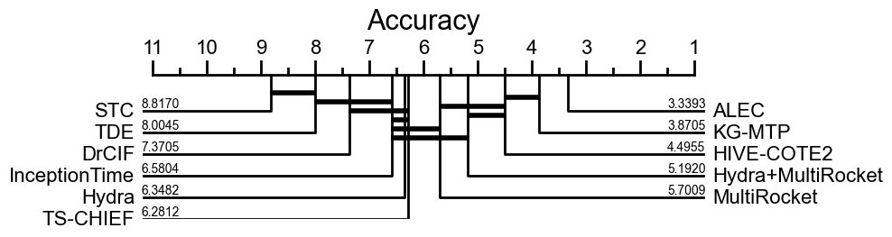
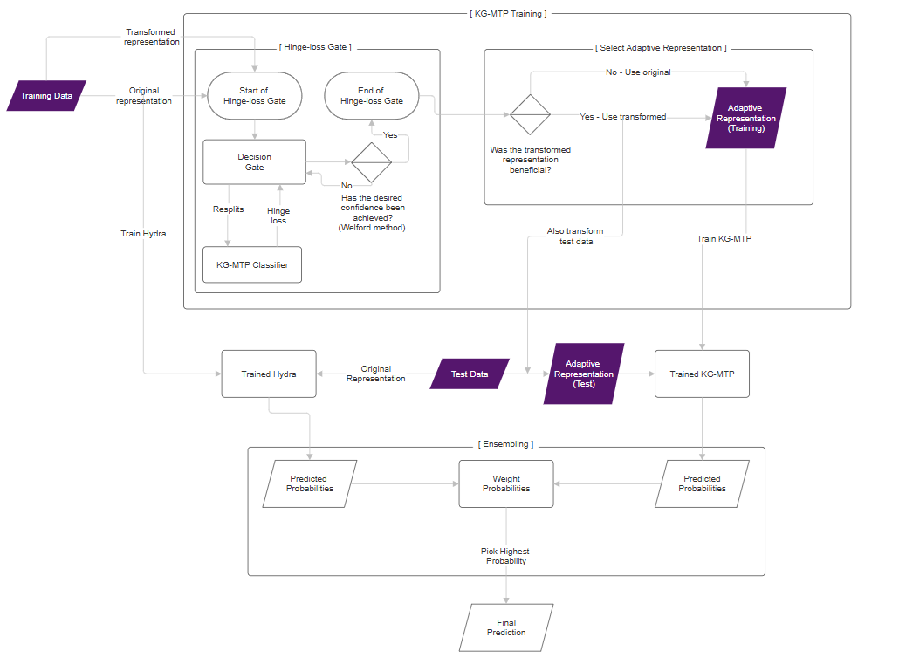
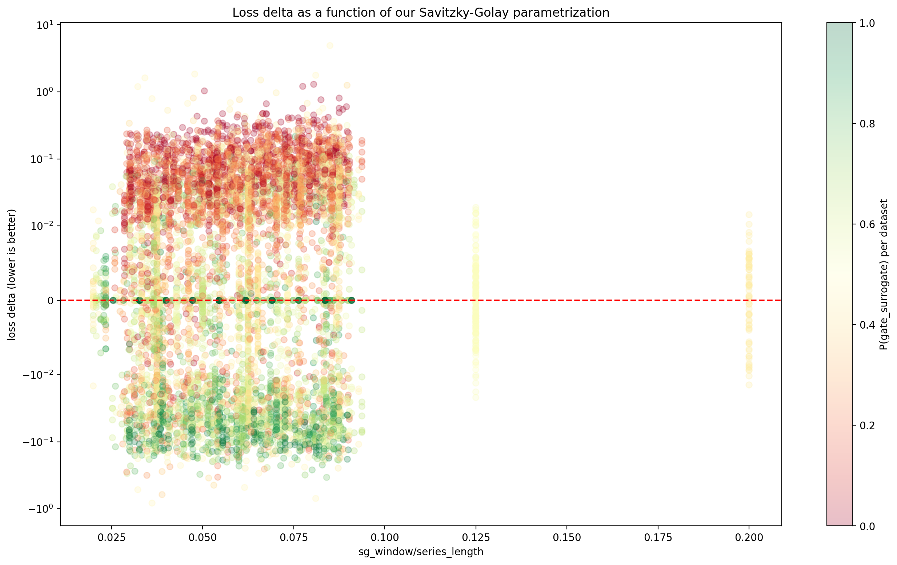

# Adaptive Loss probing Ensemble Classifier (ALEC)

ALEC is an enhanced implementation of KG-MTP combined with a Hydra ensemble and a loss-gated adaptive Savitzky–Golay preprocessing stage, designed for high-accuracy time series classification on the UCR Archive



## Quick Start

```bash
# Install dependencies
pip install -r requirements.txt

# Place the rest of the UCR Datasets found on https://www.cs.ucr.edu/%7Eeamonn/time_series_data_2018/ in the directory known as datasets

# Run the main script (3-transform KG-MTP with loss-gated adaptive filtering)
python run_alec.py
```

## Results

Final Ensemble Performance:

- **Average Accuracy**: 89.62%

- **Datasets**: 112 UCR datasets

- **Resamples**: 30

- **Configuration**: Loss-gated adaptive Savitzky–Golay preprocessing + KG-MTP + Hydra

## Architecture

ALEC works by asking a simple question for each dataset:

- “Does preprocessing actually help this classifier?”

If the answer is **yes**, ALEC keeps the preprocessing.  
If the answer is **no**, ALEC safely falls back to the original signal.

This decision is made using a hinge-loss–based gate and the result is combined with Hydra in a weighted ensemble for classification.


**Main Implementation** (`run_alec.py`)

**Input representations**
- Raw time series
- Hilbert amplitude envelope
- First-order derivative

**Adaptive preprocessing**
- Savitzky–Golay filtering
- Admitted or rejected via a loss-based validation gate

**Classifiers**
- KG-MTP (Kernel Grouping with Multiple Transformations and Pooling)
- Hydra (fast random convolutional kernels)

**Final output**
- Weighted ensemble of classifier probabilities


### Models

#### Our architecture (click for bigger version)



This is the architecture that's our best configuration of ALEC:

- Preprocessing: Savitzky–Golay filter
- Adaptivity: Hinge-loss validation gate
- Classifier ensemble: Hydra + KG-MTP


#### Ablation Variants (Optional)

The following configurations are supported via command-line flags but are not the final recommended setup.

**Feature combination strategies:**

1. Feature concatenation (similar to MultiRocket–Hydra concatenation)
2. Probability-level ensembling

**Available base models:**

- MR (MultiRocket)
- H (Hydra)
- MR + H
- KG (KG-MTP)
- MR + H + KG


### Transforms

ALEC supports multiple preprocessing transforms inspired by
Large et al. (2018), selectable via command-line arguments.

examples:

```
python run_alec.py --transform=SG --window=5 --polyorder=2
python run_alec.py --transform=DFT --radius=0.1
python run_alec.py --transform=SIV_prime --numerator=5
python run_alec.py --transform=MA --window=5
```
Note
SIV_prime is a modified variant of the Symbolic Interval Value (SIV) method and is not identical to the original formulation in Large et al. (2018).


### Loss-Gated Adaptation (Why It Works)

ALEC uses a hinge-loss comparison between:
- The baseline (unfiltered signal)
- The transformed signal

A transform is accepted only if it statistically improves performance.

### Welford-Based Early Stopping

To control computation and variance, ALEC uses Welford’s online algorithm to determine when enough validation simulations have been run.

This yields:
- Stable decisions
- Near-optimal compute cost
- No leakage from test data


### Deterministic Reproducibility

- All random seeds are fixed for reproducibility, and configurable by setting the `--seed` flag when running `run_alec.py`.
- In the default configuration, ALEC produces detterministic results across runs
on the same hardware and software setup.  Both Hydra and KG-MTP determinism
has been tested on L4, T4 (low memory), and T4 (high memory) instances on
Google Colab. See `config.py` for details on how to control determinism for Hydra.





## File Structure

```
alec/
├── README.md                        # This file
├── config.py                        # Configuration module for ALEC
├── datasets_to_run.txt              # List of 112 UCR datasets
├── datasets                         # file containing UCR Datasets
├── requirements.txt                 # List of required Python packages for the project
├── run_alec.py                      # Main script
├── libs/                            # Core implementations
│   ├── hydra_basic.py               # Hydra convolutional kernels
│   ├── adaptive_transform.py        # Glue file between transforms.py and run_alec.py
│   ├── transforms.py                # Implementation of preprocessing techniques (,e.g., MA, EXP, GF, SG, DFT, SIV)
|   └── misc.py                      # Utility functions for IPython environment and negative log-likelihood computation
├── reference/                       # KG-MTP implementations
│   ├── kg_mtp_rebuild.py            # Our KG-MTP wrapper
│   └── kgmtp_core.py                # Copied from the KG-MTP GitHub repository, with some fixes
└── results/                         # Output directory (empty for submission)
```

## Key Features

1. **Loss-Gated Adaptive Preprocessing**
Automatically applies preprocessing only when it improves performance.

2. **Hydra Ensemble Integration**
Fast convolutional kernel features enrich the final classifier.

3. **Safe Experimental Design**
No test-set leakage; all gating decisions are made using resampled training data only.

## Dependencies

Install with: `pip install -r requirements.txt` or `uv sync`

## Usage

```bash
# Run on all datasets in datasets_to_run.txt
python run_alec.py
```

The script will automatically:

### 1. Load Dataset Names
Read the list of datasets to process from `datasets_to_run.txt`.

### 2. Load Datasets
For each dataset name, load the corresponding training and testing files from the `datasets/` directory.

### 3. Initialize the Algorithm
Run `run_alec.py` to initialize the experimental pipeline and configure all required parameters.

### 4. Preprocessing
Apply **loss-gated adaptive preprocessing filtering** to the training data to obtain an adaptive representation.

### 5. Train Classifiers
- Train the **KG-MTP** classifier using the adaptively preprocessed training data.
- Train the **Hydra** classifier using the original (unfiltered) training data.

### 6. Combine Predictions
Merge the predicted class probabilities from both classifiers using a **weighted ensemble**, producing the final predictions.

### 7. Save Results
After completing each dataset:
- Save all results to the `results/` directory.
- Results are written incrementally to prevent data loss.

### 8. Handle Interruptions
If execution is interrupted, previously completed datasets remain saved.  
If any experimental parameters are changed, **delete existing CSV files** in the `results/` directory before rerunning to avoid mixing results.

### 9. Compute Evaluation Summaries
For each dataset, compute and store the following metrics (where applicable):
- Minimum
- Maximum
- Median
- Standard Deviation
- Area Under the ROC Curve (AUROC)
- F1 Score
- Negative Log-Likelihood (NLL / Log Loss)
- Training Time
- Prediction Time

## Performance
**Runtime**: 35.6 hours for 112 datasets with 30 resamples on CUDA GPU


## Code Structure

### Main Script: `run_alec.py`
- Entry point for the loss-gated adaptive filtering experiment
- Orchestrates dataset loading, feature extraction, and evaluation
- Implements margin hinge loss for filter validation

### Hydra Implementation

**`libs/hydra_basic.py`**: Hydra convolutional ensemble implementation
- simplified rewrite of the [original Hydra implementation](https://github.com/angus924/hydra/blob/main/code/hydra.py)
- GPU-accelerated kernel computations
- Sparse feature scaling

### Transforms Implementation
**`libs/transforms.py`**: Implementation of Savitzky-Golay and other transforms  
**`libs/adaptive_transform.py`**: Adaptive filtering with Savitzky-Golay and other transforms

### KG-MTP Implementations

These are adapted from 3rd party code with our fixes

**`reference/kg_mtp_rebuild.py`**: Main KG-MTP ensemble logic
- Integrates multiple transforms with Hydra
- Handles evaluation and cross-validation

**`reference/kgmtp_core.py`**: Core KG-MTP kernel functions
- copied mostly verbatim from [KGMTP GitHub repository](https://github.com/WangPanJie2024/KG-MTP/blob/fd1d84fd809e178f45a6f2a68a74b82965733bec/models/KGMTP.py) with our fixes for reproducibility
- Numba-optimized feature extraction


## Citation

This implementation builds upon:

Wang, P., Wu, J., Wei, Y., & Li, T. (2025).  
Kernel grouping for time series classification with multiple transformations and pooling operators.

Dempster, A., Schmidt, D. F., & Webb, G. I. (2020).  
MultiRocket: Multiple pooling operators and transformations for fast and effective time series classification.  
Data Mining and Knowledge Discovery.  
https://doi.org/10.1007/s10618-020-00711-3

Bagnall, A., Lines, J., Bostrom, A., Large, J., & Keogh, E. (2017).  
The great time series classification bake off: A review and experimental evaluation of recent algorithmic advances.  
Data Mining and Knowledge Discovery, 31(3), 606–660.  
https://doi.org/10.1007/s10618-016-0483-9

